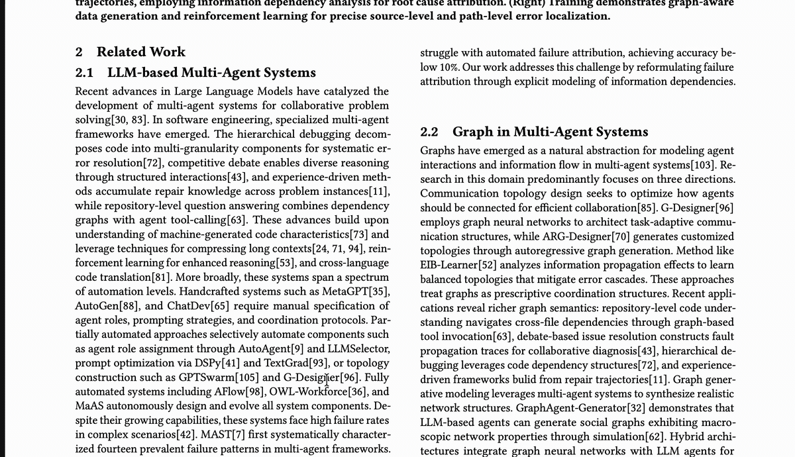

# Glint

<p align="center">
  
</p>

Glint is a macOS local translation app powered by `oMLX` and the current
`HY-MT` backend stack.

[中文](README.md) | [English](README.en.md)

> This project is maintained primarily for personal use. There is no
> ready-to-download release build at the moment.
> If you want to use Glint, please build the app and set up the local backend
> yourself.

<p align="center">
  
</p>

<p align="center">
  
</p>

## Product Overview

Glint is a menu bar translation utility for macOS. It supports clipboard
translation, selection translation, shortcut customization, and local backend
status management. It is meant for users who want to control their own model,
service, and runtime environment.

Current stack:

- `Glint` handles the macOS menu bar experience and translation entry points
- `oMLX` provides the local service layer
- `HY-MT1.5-1.8B-4bit` is the current default model

## Quick Start

```bash
uv sync
cp configs/omlx.env.example configs/omlx.env
mkdir -p models/HY-MT1.5-1.8B-4bit
zsh scripts/start_omlx_tmux.sh
zsh scripts/status_omlx.sh
open mac-app/HYMTQuickTranslate/Glint.xcodeproj
```

If you want to verify the CLI path first:

```bash
uv run python scripts/repl_translate.py
```

If you want to build the macOS app directly:

```bash
zsh scripts/build_mac_app.sh
```

## macOS App

### Run Glint

1. Open `mac-app/HYMTQuickTranslate/Glint.xcodeproj`.
2. Make sure the local `oMLX` service is running at `http://127.0.0.1:8001`.
3. Run the `Glint` scheme.
4. Use the menu bar item to trigger translation or configure shortcuts.

### Menu Bar Features

- The menu shows backend status so you can see whether translation is usable.
- `Start Service`, `Stop Service`, `Restart Service`, and `Refresh Status`
  manage the local backend.
- `Translate Clipboard` reads text from the clipboard and opens the overlay.
- `Translate Selection` reads the current selection and tries to place the
  result near the cursor.
- Translation entries are disabled while the backend is unavailable or still
  starting.
- `Selection Shortcut` and `Clipboard Shortcut` record two separate global
  shortcuts.

### Default Shortcuts

- Clipboard: `Control + Option + Command + T`
- Selection: `Control + Option + Command + S`

### Selection and Clipboard

- Clipboard translation always reads the pasteboard and opens centered.
- Selection translation uses the macOS Accessibility API to read the current
  selection.
- The selection path tries to appear near the cursor and falls back to a
  centered overlay if needed.
- The selection path does not fall back to clipboard contents. If no supported
  selection exists, the app reports an error.

### Shortcut Configuration

- Clipboard and selection shortcuts are configured independently.
- Duplicate assignments are rejected during recording.
- Updated shortcuts are persisted and restored on next launch.

## Local Backend

Glint depends on a local `oMLX` service for translation. Service settings live
in `configs/omlx.env`, which you can copy from the example file:

```bash
cp configs/omlx.env.example configs/omlx.env
```

Start the service:

```bash
zsh scripts/start_omlx.sh
```

Stop the service:

```bash
zsh scripts/stop_omlx.sh
```

Check status:

```bash
zsh scripts/status_omlx.sh
```

If you use the macOS LaunchAgent:

```bash
zsh scripts/install_omlx_launch_agent.sh
zsh scripts/start_omlx_launch_agent.sh
zsh scripts/status_omlx_launch_agent.sh
```

### Verification Commands

CLI smoke test:

```bash
uv run python scripts/smoke_cli.py \
  --model-id ./models/HY-MT1.5-1.8B-4bit \
  --text "It is a pleasure to meet you." \
  --target-language 中文 \
  --max-tokens 64
```

Expected output:

```text
很高兴能见到您。
```

Full smoke suite:

```bash
uv run python scripts/smoke_suite.py
```

OpenAI-compatible API smoke test:

```bash
python3 scripts/api_smoke.py
```

## Model And Prompt

Recommended local model directory:

- `models/HY-MT1.5-1.8B-4bit`

Download sources:

- `mlx-community/HY-MT1.5-1.8B-4bit`
- `tencent/HY-MT1.5-1.8B`

At minimum, place these files into `models/HY-MT1.5-1.8B-4bit/`:

- `model.safetensors`
- `config.json`
- `tokenizer.json`
- `tokenizer_config.json`
- `special_tokens_map.json`

The project follows the official HY-MT translation prompt format:

```text
将以下文本翻译为{target_language}，注意只需要输出翻译后的结果，不要额外解释：

{source_text}
```

Recommended inference settings:

- `top_k: 20`
- `top_p: 0.6`
- `repetition_penalty: 1.05`
- `temperature: 0.7`

## Project Layout

- CLI environment: `.venv`
- oMLX environment: `.venv-omlx`
- Model path: `models/HY-MT1.5-1.8B-4bit`
- Local service overrides: `configs/omlx.env`
- Glint app: `mac-app/HYMTQuickTranslate/Glint.xcodeproj`

## Upstream

- oMLX repository: https://github.com/jundot/omlx
- Tencent Hunyuan HY-MT: https://github.com/Tencent-Hunyuan/HY-MT
- MLX community model: https://huggingface.co/mlx-community/HY-MT1.5-1.8B-4bit
