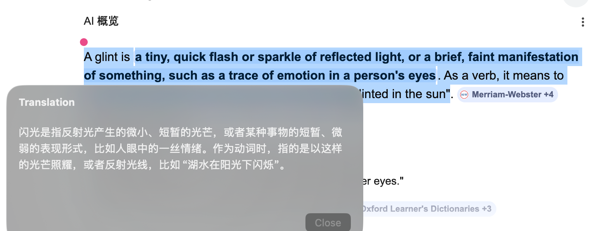

# Glint

<p align="center">
  
</p>

Glint 是一个面向 macOS 的菜单栏翻译客户端。

[中文](README.md) | [English](README.en.md)

<p align="center">
  
</p>

<p align="center">
  
</p>

<p align="center">
  <a href="docs/assets/glint-ocr-demo.mp4">查看 OCR 演示原视频</a>
</p>

## 项目定位

Glint 只负责 macOS 端交互：

- 菜单栏常驻
- 剪贴板翻译
- 选区翻译
- OCR 区域翻译
- 快捷键配置
- API 连接配置

Glint ** 不再负责 ** 模型下载、服务启动、进程保活或本地部署脚本。

如果你需要我日常使用的后端部署仓库，请使用：

- `https://github.com/ZhengRui-Chen/HY-MT`

## API 要求

Glint 依赖一个 OpenAI-compatible API，当前会使用：

- `POST /v1/chat/completions`
- `GET /v1/models`

`/v1/models` 只用于拉取模型列表。
如果你的后端没有提供这个接口，仍然可以直接手动输入 `model`。

## macOS App

### 运行

1. 打开 `mac-app/Glint.xcodeproj`
2. 运行 `Glint` scheme
3. 在菜单栏打开 `API Settings…`
4. 配置 `Base URL`、`API Key`、`Model`

也可以直接构建：

```bash
zsh scripts/build_mac_app.sh
```

如果你要生成一个普通可分发的 DMG：

```bash
zsh scripts/build_dmg.sh
```

产物会写到 `dist/Glint.dmg`。

### API Settings

`API Settings…` 面板提供三项配置：

- `Base URL`
- `API Key`
- `Model`

其中：

- `Model` 支持手动输入
- `Model` 也支持从 `/v1/models` 刷新后下拉选择
- 配置保存在 `UserDefaults`

### 菜单栏能力

- 菜单顶部显示当前 API 状态
- `Refresh Status` 用于主动刷新连通性
- `Translate Clipboard` 从剪贴板读取文本并展示翻译
- `Translate Selection` 读取当前选区并尽量在光标附近展示结果
- `Translate OCR Area` 允许框选屏幕区域做 OCR 后翻译
- `Keyboard Shortcuts…` 用于录制全局快捷键

### 默认快捷键

- Clipboard: `Control + Option + Command + T`
- Selection: `Control + Option + Command + S`
- OCR: `Control + Option + Command + O`

## 后端仓库

当前推荐把后端部署、模型管理和服务运维放在独立仓库中：

- `https://github.com/ZhengRui-Chen/HY-MT`

你可以先在那个仓库里准备好服务，再把连接信息填回 Glint。
